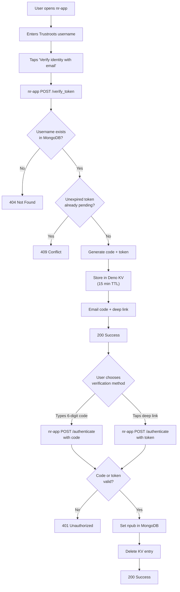
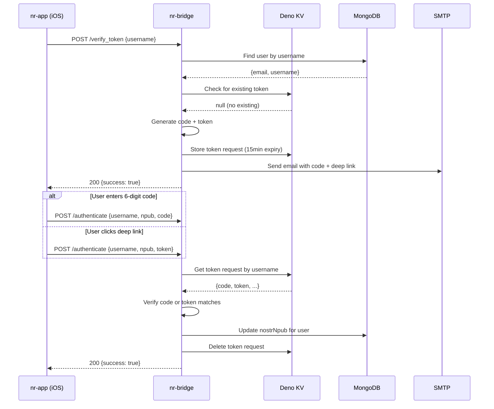
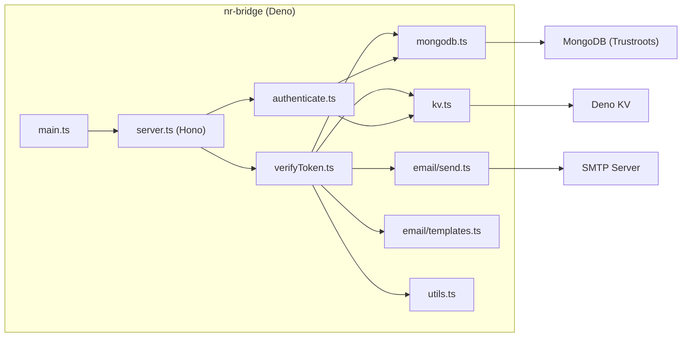

# nr-bridge

Bridge between the legacy [Trustroots.org](https://www.trustroots.org) MongoDB
user database and the new Nostr-based Nostroots iOS app. The service verifies
that a user owns the email address associated with their Trustroots username and,
once verified, writes their Nostr public key (`npub`) into the MongoDB `users`
collection.

## Overview

nr-bridge is a lightweight Deno server that exposes two HTTP endpoints. It uses
Deno KV for short-lived verification state and communicates with the Trustroots
MongoDB instance to read and update user records.

```
┌─────────────┐       ┌────────────┐       ┌──────────┐
│  nr-app     │──────>│  nr-bridge │──────>│  MongoDB  │
│  (iOS app)  │<──────│  (Deno)    │<──────│ (Trustroots)
└─────────────┘       └─────┬──────┘       └──────────┘
                            │
                      ┌─────┴──────┐
                      │  Deno KV   │
                      │  (tokens)  │
                      └────────────┘
```

### Tech Stack

| Component     | Technology              |
| ------------- | ----------------------- |
| Runtime       | Deno 2.6.6              |
| HTTP server   | Hono (JSR)              |
| Validation    | Zod                     |
| Database      | MongoDB 7 (Trustroots)  |
| Token storage | Deno KV                 |
| Email         | denomailer (SMTP)       |
| Testing       | Deno.test + @std/expect |

---

## User Flow

### Goal

Verify that a Nostroots app user owns the email address tied to their Trustroots
username, then persist their Nostr `npub` in MongoDB so the two identities are
linked.

### Step-by-Step

1. The user opens the nr-app iOS app and enters their Trustroots username.
2. The app sends `POST /verify_token` with the username.
3. nr-bridge looks up the username in MongoDB, generates a six-digit code and a
   UUID token, stores both in Deno KV (15 min TTL), and emails the user.
4. The email contains **two** ways to verify:
   - A **six-digit code** the user can type into the app.
   - A **deep link** (`nostroots://verify?token=<uuid>`) that opens the app
     directly, bypassing the code entry screen.
5. The app sends `POST /authenticate` with the username, the user's `npub`, and
   either the code or the token.
6. nr-bridge validates the credential against Deno KV, writes the `npub` to
   MongoDB, and deletes the KV entry.

### User Flow Diagram



### Sequence Diagram



---

## API Reference

### `POST /verify_token`

Initiate email verification for a Trustroots username.

**Request**

```
POST /verify_token
Content-Type: application/json
```

```json
{
  "username": "alice"
}
```

| Field      | Type   | Required | Description                          |
| ---------- | ------ | -------- | ------------------------------------ |
| `username` | string | yes      | Trustroots username (case-insensitive, min 1 char) |

**Responses**

| Status | Body                                                  | Meaning                                        |
| ------ | ----------------------------------------------------- | ---------------------------------------------- |
| `200`  | `{ "success": true }`                                 | Verification email sent                        |
| `400`  | `{ "error": "Invalid request", "details": {...} }`    | Request body failed Zod validation             |
| `404`  | `{ "error": "User not found" }`                       | No user with that username in MongoDB          |
| `409`  | `{ "error": "Verification already pending" }`         | An unexpired token already exists for this user |

**Side effects**

- Creates a token request entry in Deno KV (key: `["tokenRequests", username]`,
  TTL: 15 minutes).
- Sends an HTML email to the address on file containing:
  - A six-digit verification code.
  - A deep link: `nostroots://verify?token=<uuid>`.

---

### `POST /authenticate`

Complete verification by providing the six-digit code or the deep-link token,
along with the user's Nostr public key.

**Request**

```
POST /authenticate
Content-Type: application/json
```

```json
{
  "username": "alice",
  "npub": "npub1abc123...",
  "code": "482937"
}
```

or

```json
{
  "username": "alice",
  "npub": "npub1abc123...",
  "token": "550e8400-e29b-41d4-a716-446655440000"
}
```

| Field      | Type   | Required | Description                                      |
| ---------- | ------ | -------- | ------------------------------------------------ |
| `username` | string | yes      | Trustroots username                              |
| `npub`     | string | yes      | Nostr public key (must start with `"npub"`)      |
| `code`     | string | no*      | Six-digit numeric code from the email            |
| `token`    | string | no*      | UUID token from the deep link                    |

*At least one of `code` or `token` must be provided.

**Responses**

| Status | Body                                                        | Meaning                                  |
| ------ | ----------------------------------------------------------- | ---------------------------------------- |
| `200`  | `{ "success": true }`                                       | npub written to MongoDB                  |
| `400`  | `{ "error": "Invalid request", "details": {...} }`          | Validation failed (missing fields, bad npub, etc.) |
| `401`  | `{ "error": "No pending verification or code expired" }`    | No token request in KV or it has expired |
| `401`  | `{ "error": "Invalid code or token" }`                      | Code/token does not match                |
| `500`  | `{ "error": "Failed to update user" }`                      | MongoDB update did not modify a document |

**Side effects**

- Sets the `nostrNpub` field and updates the `updated` timestamp on the
  matching user document in MongoDB.
- Deletes the token request from Deno KV.

---

## Data Model

### Token Request (Deno KV)

Stored under the key `["tokenRequests", <username>]` with a 15-minute TTL via
Deno KV's `expireIn` option. An additional application-level check on
`expiresAt` guards against clock drift.

| Field       | Type             | Description                              |
| ----------- | ---------------- | ---------------------------------------- |
| `id`        | string (UUID v4) | Unique identifier for this request       |
| `username`  | string           | Trustroots username                      |
| `email`     | string           | Email address from MongoDB               |
| `code`      | string?          | Six-digit numeric code (`100000`-`999999`) |
| `token`     | string?          | UUID v4 for deep-link verification       |
| `createdAt` | number           | Unix ms timestamp of creation            |
| `expiresAt` | number           | Unix ms timestamp of expiry              |

### MongoDB User (relevant fields)

The `users` collection in the Trustroots database. nr-bridge only reads
`username` and `email`, and writes `nostrNpub` and `updated`.

| Field       | Type   | Description                        |
| ----------- | ------ | ---------------------------------- |
| `username`  | string | Unique, lowercase Trustroots username |
| `email`     | string | User's email address               |
| `nostrNpub` | string | Nostr public key (set by nr-bridge) |
| `updated`   | Date   | Last-modified timestamp            |

---

## Architecture

### Component Diagram



### Directory Structure

```
nr-bridge/
├── deno.json                        # Tasks, imports, permissions
├── main.ts                          # Entry point: starts Hono server
├── schemas/
│   ├── user.ts                      # Full Zod UserSchema (mirrors Mongoose)
│   ├── nrBridgeUser.ts              # Subset: username, email, nostrNpub, ...
│   └── tokenRequest.ts             # Token request schema + request body schemas
├── src/
│   ├── server.ts                    # Hono app with route registration
│   ├── utils.ts                     # generateSixDigitCode(), generateToken()
│   ├── routes/
│   │   ├── verifyToken.ts           # POST /verify_token handler
│   │   └── authenticate.ts          # POST /authenticate handler
│   ├── db/
│   │   ├── mongodb.ts               # MongoDB client, findUserByUsername, setNpubForUsername
│   │   └── kv.ts                    # Deno KV CRUD for token requests
│   └── email/
│       ├── send.ts                  # SMTP sending via denomailer
│       └── templates.ts             # HTML email template (code + deep link)
├── tests/
│   ├── unit/
│   │   ├── utils.test.ts            # Code/token generation tests
│   │   ├── schemas.test.ts          # Zod schema validation tests
│   │   ├── tokenRequest.test.ts     # KV CRUD tests (in-memory)
│   │   └── routes.test.ts           # Route handler tests (mocked deps)
│   └── e2e/
│       ├── verifyToken.test.ts      # Full /verify_token flow with MongoDB
│       └── authenticate.test.ts     # Full /authenticate flow with MongoDB
└── trustroots_docs/
    └── user.server.model.js         # Legacy Mongoose model (reference only)
```

---

## Development

### Prerequisites

- [Deno 2.6.6+](https://deno.land/)
- MongoDB 7 (provided by the devcontainer)

### Dev Container

The recommended way to develop is with the VS Code devcontainer at
`.devcontainer/nr-bridge/`. It provides:

- Deno 2.6.6 with `mongosh`
- MongoDB 7 seeded from `trustroots_docs/trustroots-dev.archive`
- `MONGODB_URI` pre-configured to `mongodb://mongodb:27017/trustroots-dev`

Open the repo in VS Code, select **Reopen in Container**, and choose
**Nostroots Bridge**.

### Running Locally

```bash
# Start the server (port 8000 by default)
cd nr-bridge
deno task run

# Start with file-watching
deno task dev
```

### Running Tests

```bash
cd nr-bridge

# Run all tests (unit + e2e)
deno task test

# Run only unit tests
deno test --allow-net --allow-env --allow-sys --allow-read --allow-write --unstable-kv tests/unit/

# Run only e2e tests (requires MongoDB)
deno test --allow-net --allow-env --allow-sys --allow-read --allow-write --unstable-kv tests/e2e/
```

The test suite includes 27 tests:

| Suite                  | Count | Description                                |
| ---------------------- | ----- | ------------------------------------------ |
| `utils.test.ts`        | 5     | Code generation, token generation          |
| `schemas.test.ts`      | 9     | Zod schema accept/reject cases             |
| `tokenRequest.test.ts` | 4     | Deno KV CRUD with in-memory store          |
| `routes.test.ts`       | 5     | Route handlers with mocked dependencies    |
| `verifyToken.test.ts`  | 1     | E2E: /verify_token against real MongoDB    |
| `authenticate.test.ts` | 3     | E2E: /authenticate against real MongoDB    |

Unit tests use `:memory:` Deno KV instances so they require no external
services. E2E tests connect to the MongoDB instance from the devcontainer.

---

## Environment Variables

| Variable         | Description                | Default                                  |
| ---------------- | -------------------------- | ---------------------------------------- |
| `MONGODB_URI`    | MongoDB connection string  | `mongodb://mongodb:27017/trustroots-dev` |
| `PORT`           | HTTP server port           | `8000`                                   |
| `SMTP_HOST`      | SMTP server hostname       | *(required)*                             |
| `SMTP_PORT`      | SMTP server port           | `587`                                    |
| `SMTP_USER`      | SMTP username              | *(required)*                             |
| `SMTP_PASS`      | SMTP password              | *(required)*                             |
| `SMTP_FROM`      | Sender email address       | `noreply@nostroots.com`                  |
| `DEEP_LINK_BASE` | Base URL for iOS deep link | `nostroots://verify`                     |
| `DENO_KV_PATH`   | Path to Deno KV database   | *(Deno default)*                         |

---

## Error Handling

All error responses follow a consistent JSON shape:

```json
{
  "error": "Human-readable message"
}
```

Validation errors (status `400`) include an additional `details` field with
Zod's flattened error output:

```json
{
  "error": "Invalid request",
  "details": {
    "fieldErrors": {
      "username": ["String must contain at least 1 character(s)"]
    },
    "formErrors": []
  }
}
```

---

## Email Template

The verification email is a responsive HTML email with:

- **Header** -- Nostroots branding.
- **Code block** -- The six-digit code displayed in a large monospace font
  with letter-spacing for readability.
- **Deep link button** -- "Open Nostroots" button linking to
  `nostroots://verify?token=<uuid>`.
- **Footer** -- Expiry notice ("This code expires in 15 minutes") and a
  safe-to-ignore disclaimer.

---

## Security Considerations

- **Code entropy** -- Six-digit codes are generated with
  `crypto.getRandomValues()`, not `Math.random()`.
- **Token entropy** -- Deep-link tokens are UUID v4 via `crypto.randomUUID()`.
- **TTL** -- Token requests expire after 15 minutes at both the KV level
  (`expireIn`) and the application level (`expiresAt` timestamp check).
- **npub validation** -- The `npub` field is validated to start with `"npub"` to
  prevent accidental submission of secret keys (`nsec`).
- **No credentials in responses** -- Neither the code nor the token is ever
  returned in an HTTP response; they are only delivered via email.
