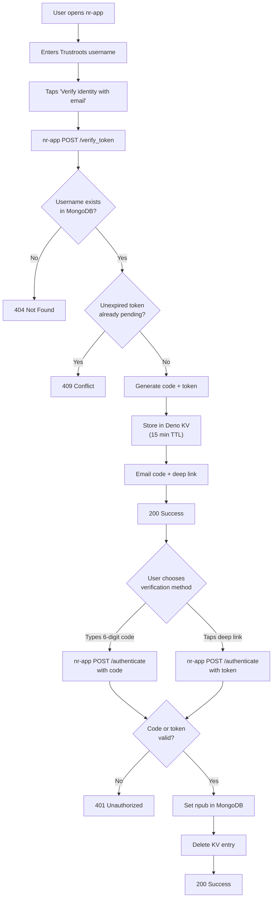

# nr-bridge

Bridge between the legacy [Trustroots.org](https://www.trustroots.org) MongoDB
user database and the new Nostr-based Nostroots iOS app. The service verifies
that a user owns the email address associated with their Trustroots username
and, once verified, writes their Nostr public key (`npub`) into the MongoDB
`users` collection.

nr-bridge is a lightweight Deno server that exposes two HTTP endpoints. It uses
Deno KV for short-lived verification state and communicates with the Trustroots
MongoDB instance to read and update user records.

```
┌─────────────┐       ┌────────────┐       ┌──────────┐
│  nr-app     │──────>│  nr-bridge │──────>│  MongoDB  │
│  (iOS app)  │<──────│  (Deno)    │<──────│ (Trustroots)
└─────────────┘       └─────┬──────┘       └──────────┘
                            │
                      ┌─────┴──────┐
                      │  Deno KV   │
                      │  (tokens)  │
                      └────────────┘
```

---

## Environment Variables

| Variable         | Description                              | Default / Required                      |
| ---------------- | ---------------------------------------- | --------------------------------------- |
| `MONGODB_URI`    | MongoDB connection string                | `mongodb://mongodb:27017/trustroots-dev` |
| `PORT`           | HTTP server port                         | `8000`                                  |
| `DENO_KV_PATH`   | Path to Deno KV database                 | **required** (use `:memory:` in tests)  |
| `SMTP_HOST`      | SMTP server hostname                     | _(empty — validated at send time)_      |
| `SMTP_PORT`      | SMTP server port                         | `587`                                   |
| `SMTP_USER`      | SMTP username                            | _(empty — omit if no auth)_             |
| `SMTP_PASS`      | SMTP password                            | _(empty — omit if no auth)_             |
| `SMTP_FROM`      | Sender email address                     | `support@trustroots.org`                |
| `DEEP_LINK_BASE` | Base URL for iOS deep link               | _(unset — deep-link button omitted)_    |

In the devcontainer, `MONGODB_URI` is pre-set to `mongodb://mongodb:27017/trustroots-dev`,
SMTP points to the local Mailpit instance (`127.0.0.1:1025`), and `DENO_KV_PATH` is set
to a local file path.

---

## API Reference

### `POST /verify_token`

Initiate email verification for a Trustroots username.

**Request**

```json
{ "username": "alice" }
```

**Responses**

| Status | Body                                               | Meaning                                         |
| ------ | -------------------------------------------------- | ----------------------------------------------- |
| `200`  | `{ "success": true }`                              | Verification email sent                         |
| `400`  | `{ "error": "Invalid request", "details": {...} }` | Request body failed Zod validation              |
| `404`  | `{ "error": "User not found" }`                    | No user with that username in MongoDB           |
| `409`  | `{ "error": "Verification already pending" }`      | An unexpired token already exists for this user |

Creates a token request in Deno KV (TTL: 15 min) and emails the user a six-digit
code and a deep link (`${DEEP_LINK_BASE}?token=<uuid>`).

---

### `POST /authenticate`

Complete verification by providing the six-digit code or the deep-link token,
along with the user's Nostr public key.

**Request** (one of):

```json
{ "username": "alice", "npub": "npub1abc123...", "code": "482937" }
{ "username": "alice", "npub": "npub1abc123...", "token": "550e8400-..." }
```

**Responses**

| Status | Body                                                     | Meaning                                            |
| ------ | -------------------------------------------------------- | -------------------------------------------------- |
| `200`  | `{ "success": true }`                                    | npub written to MongoDB                            |
| `400`  | `{ "error": "Invalid request", "details": {...} }`       | Validation failed (missing fields, bad npub, etc.) |
| `401`  | `{ "error": "No pending verification or code expired" }` | No token request in KV or it has expired           |
| `401`  | `{ "error": "Invalid code or token" }`                   | Code/token does not match                          |
| `500`  | `{ "error": "Failed to update user" }`                   | MongoDB update did not modify a document           |

Sets `nostrNpub` on the matching MongoDB user and deletes the KV entry.

---

## Development

### Prerequisites

- [Deno 2.6.6+](https://deno.land/)
- MongoDB 7 (provided by the devcontainer)

### Dev Container

Use the devcontainer that matches the services you need:

- `.devcontainer/metro/` starts only the shared app container. Use this for
  Metro-only `nr-app` work when you do not need `nr-bridge` or MongoDB.
- `.devcontainer/nr-bridge/` starts the same shared app container plus MongoDB.
  Use this when you need to run the `nr-bridge` Deno app, its e2e tests, or
  Metro against the bridge-backed development database.

Open the repo in VS Code, select **Reopen in Container**, and choose **Nostroots
Bridge** when you need MongoDB. From that container, you can run both:

```bash
cd nr-bridge
deno task dev

cd ../nr-app
EXPO_DEBUG=1 pnpm run start --dev-client
```

See `.devcontainer/readme.md` for the full simulator/emulator workflow.

### Running Locally

```bash
cd nr-bridge
deno task run   # Start the server (port 8000)
deno task dev   # Start with file-watching
```

### Seeding Development Users

```bash
cd nr-bridge
deno task seed:dev-users   # Upsert alice and bob (safe to re-run)
deno task seed:fake-user   # Insert one new fake user
```

### Capturing Emails In Development

The devcontainer includes [Mailpit](https://mailpit.axllent.org/). Start it in
the app container:

```bash
mailpit --listen 0.0.0.0:8025 --smtp 0.0.0.0:1025
```

Trigger `POST /verify_token` and open `http://localhost:8025` to read the email.

### Running Tests

```bash
cd nr-bridge
deno task test                    # All tests (unit + e2e)
deno test ... tests/unit/         # Unit tests only (no external services needed)
deno test ... tests/e2e/          # E2E tests (requires MongoDB)
```

Unit tests use `:memory:` Deno KV so they require no external services. E2E
tests connect to the MongoDB instance from the devcontainer.

---

## User Flow


```mermaid
flowchart TD
    A["User opens nr-app"] --> B["Enters Trustroots username"]
    B --> C["Taps 'Verify identity with email'"]
    C --> D["nr-app POST /verify_token"]
    D --> E{"Username exists\nin MongoDB?"}
    E -- No --> F["404 Not Found"]
    E -- Yes --> G{"Unexpired token\nalready pending?"}
    G -- Yes --> H["409 Conflict"]
    G -- No --> I["Generate code + token"]
    I --> J["Store in Deno KV\n(15 min TTL)"]
    J --> K["Email code + deep link"]
    K --> L["200 Success"]
    L --> M{"User chooses\nverification method"}
    M -- "Types 6-digit code" --> N["nr-app POST /authenticate\nwith code"]
    M -- "Taps deep link" --> O["nr-app POST /authenticate\nwith token"]
    N --> P{"Code or token\nvalid?"}
    O --> P
    P -- No --> Q["401 Unauthorized"]
    P -- Yes --> R["Set npub in MongoDB"]
    R --> S["Delete KV entry"]
    S --> T["200 Success"]
```

---

## Data Model

### Token Request (Deno KV)

Stored under `["tokenRequests", <username>]` with a 15-minute TTL.

| Field       | Type             | Description                                |
| ----------- | ---------------- | ------------------------------------------ |
| `id`        | string (UUID v4) | Unique identifier for this request         |
| `username`  | string           | Trustroots username                        |
| `email`     | string           | Email address from MongoDB                 |
| `code`      | string?          | Six-digit numeric code (`100000`-`999999`) |
| `token`     | string?          | UUID v4 for deep-link verification         |
| `createdAt` | number           | Unix ms timestamp of creation              |
| `expiresAt` | number           | Unix ms timestamp of expiry                |

### MongoDB User (relevant fields)

nr-bridge reads `username` and `email`, and writes `nostrNpub` and `updated`.

| Field       | Type   | Description                           |
| ----------- | ------ | ------------------------------------- |
| `username`  | string | Unique, lowercase Trustroots username |
| `email`     | string | User's email address                  |
| `nostrNpub` | string | Nostr public key (set by nr-bridge)   |
| `updated`   | Date   | Last-modified timestamp               |

---

## Error Handling

All error responses follow a consistent JSON shape:

```json
{ "error": "Human-readable message" }
```

Validation errors (status `400`) include an additional `details` field with
Zod's flattened error output:

```json
{
  "error": "Invalid request",
  "details": {
    "fieldErrors": { "username": ["String must contain at least 1 character(s)"] },
    "formErrors": []
  }
}
```

---

## Security Considerations

- **Code entropy** -- Six-digit codes use `crypto.getRandomValues()`, not `Math.random()`.
- **Token entropy** -- Deep-link tokens are UUID v4 via `crypto.randomUUID()`.
- **TTL** -- Token requests expire after 15 minutes at both the KV level
  (`expireIn`) and application level (`expiresAt` timestamp check).
- **npub validation** -- The `npub` field must start with `"npub"` to prevent
  accidental submission of secret keys (`nsec`).
- **No credentials in responses** -- Neither the code nor the token is ever
  returned in an HTTP response; they are only delivered via email.
