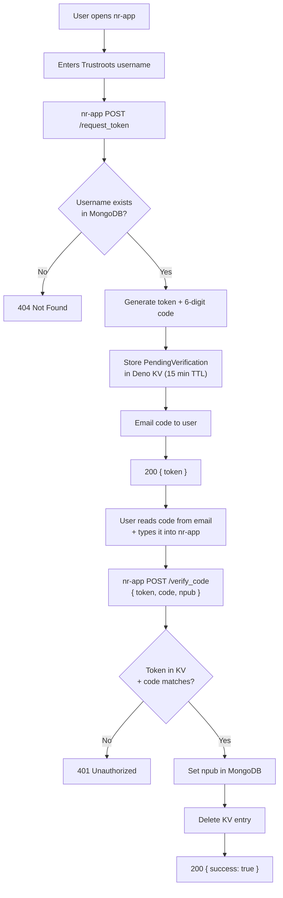
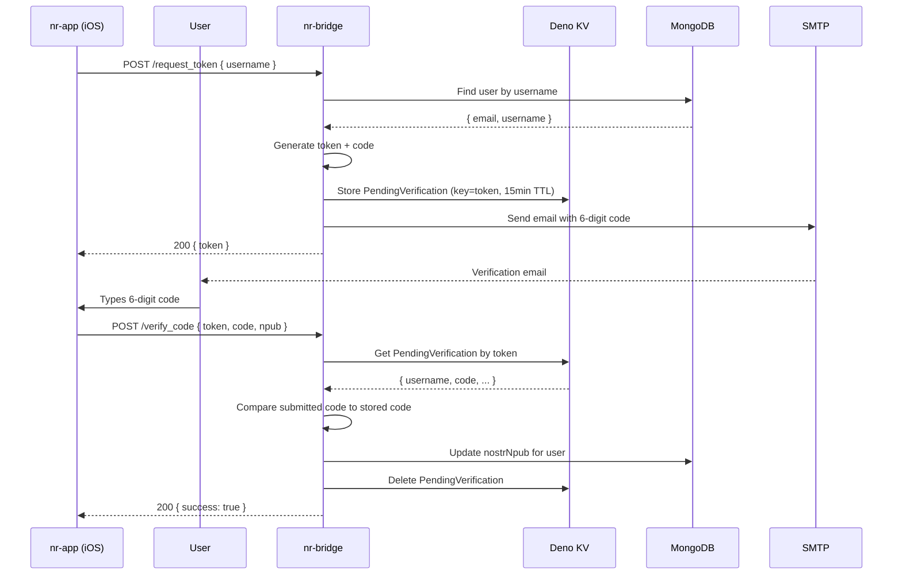
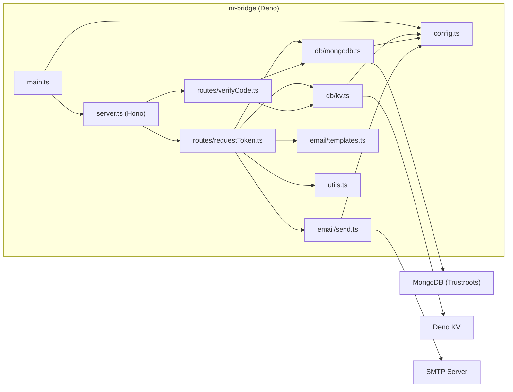

# nr-bridge

Bridge between the legacy [Trustroots.org](https://www.trustroots.org) MongoDB
user database and the new Nostr-based Nostroots iOS app. The service verifies
that a user owns the email address associated with their Trustroots username
and, once verified, writes their Nostr public key (`npub`) into the MongoDB
`users` collection.

## Overview

nr-bridge is a lightweight Deno server that exposes two HTTP endpoints. It uses
Deno KV for short-lived verification state and communicates with the Trustroots
MongoDB instance to read and update user records.

```
┌─────────────┐       ┌────────────┐       ┌──────────┐
│  nr-app     │──────>│  nr-bridge │──────>│  MongoDB  │
│  (iOS app)  │<──────│  (Deno)    │<──────│ (Trustroots)
└─────────────┘       └─────┬──────┘       └──────────┘
                            │
                      ┌─────┴──────┐
                      │  Deno KV   │
                      │  (tokens)  │
                      └────────────┘
```

### Tech Stack

| Component     | Technology              |
| ------------- | ----------------------- |
| Runtime       | Deno 2.6.6              |
| HTTP server   | Hono (JSR)              |
| Validation    | Zod                     |
| Database      | MongoDB 7 (Trustroots)  |
| Token storage | Deno KV                 |
| Email         | denomailer (SMTP)       |
| Testing       | Deno.test + @std/expect |

---

## User Flow

### Goal

Verify that a Nostroots app user owns the email address tied to their Trustroots
username, then persist their Nostr `npub` in MongoDB so the two identities are
linked.

### Step-by-Step

1. The user opens the nr-app iOS app and enters their Trustroots username.
2. The app sends `POST /request_token` with the username.
3. nr-bridge looks up the username in MongoDB, generates a UUID `token` and a
   six-digit `code`, stores both as a `PendingVerification` in Deno KV (15 min
   TTL), emails the code to the user, and returns the `token` to the app in the
   response body.
4. The user reads the six-digit code from their email and types it into the app.
5. The app sends `POST /verify_code` with `{ token, code, npub }` — `token` from
   step 3 (proving it's the same client) and `code` from the email (proving the
   user controls the inbox).
6. nr-bridge looks up the pending verification by token, checks the supplied
   code matches, writes the `npub` to MongoDB, and deletes the KV entry.

### User Flow Diagram


```mermaid
flowchart TD
    A["User opens nr-app"] --> B["Enters Trustroots username"]
    B --> C["nr-app POST /request_token"]
    C --> D{"Username exists\nin MongoDB?"}
    D -- No --> E["404 Not Found"]
    D -- Yes --> F["Generate token + 6-digit code"]
    F --> G["Store PendingVerification\nin Deno KV (15 min TTL)"]
    G --> H["Email code to user"]
    H --> I["200 { token }"]
    I --> J["User reads code from email\n+ types it into nr-app"]
    J --> K["nr-app POST /verify_code\n{ token, code, npub }"]
    K --> L{"Token in KV\n+ code matches?"}
    L -- No --> M["401 Unauthorized"]
    L -- Yes --> N["Set npub in MongoDB"]
    N --> O["Delete KV entry"]
    O --> P["200 { success: true }"]
```

### Sequence Diagram


```mermaid
sequenceDiagram
    participant App as nr-app (iOS)
    participant User as User
    participant Bridge as nr-bridge
    participant KV as Deno KV
    participant Mongo as MongoDB
    participant Email as SMTP

    App->>Bridge: POST /request_token { username }
    Bridge->>Mongo: Find user by username
    Mongo-->>Bridge: { email, username }
    Bridge->>Bridge: Generate token + code
    Bridge->>KV: Store PendingVerification (key=token, 15min TTL)
    Bridge->>Email: Send email with 6-digit code
    Bridge-->>App: 200 { token }
    Email-->>User: Verification email
    User->>App: Types 6-digit code
    App->>Bridge: POST /verify_code { token, code, npub }
    Bridge->>KV: Get PendingVerification by token
    KV-->>Bridge: { username, code, ... }
    Bridge->>Bridge: Compare submitted code to stored code
    Bridge->>Mongo: Update nostrNpub for user
    Bridge->>KV: Delete PendingVerification
    Bridge-->>App: 200 { success: true }
```

---

## API Reference

### `POST /request_token`

Start an email verification for a Trustroots username. Returns a `token` the
client must hold onto and supply back to `POST /verify_code`.

**Request**

```
POST /request_token
Content-Type: application/json
```

```json
{
  "username": "alice"
}
```

| Field      | Type   | Required | Description                                        |
| ---------- | ------ | -------- | -------------------------------------------------- |
| `username` | string | yes      | Trustroots username (case-insensitive, min 1 char) |

**Responses**

| Status | Body                                                  | Meaning                               |
| ------ | ----------------------------------------------------- | ------------------------------------- |
| `200`  | `{ "token": "550e8400-e29b-41d4-a716-446655440000" }` | Verification email sent               |
| `400`  | `{ "error": "Invalid request", "details": {...} }`    | Request body failed Zod validation    |
| `404`  | `{ "error": "User not found" }`                       | No user with that username in MongoDB |

**Side effects**

- Creates a `PendingVerification` in Deno KV (key:
  `["pendingVerifications", token]`, TTL: 15 minutes) containing the token, the
  six-digit code, and the user's identity.
- Sends an HTML email to the address on file containing the six-digit code.

---

### `POST /verify_code`

Complete verification by supplying the `token` from `POST /request_token` and
the `code` the user received in their email, together with the user's Nostr
public key.

**Request**

```
POST /verify_code
Content-Type: application/json
```

```json
{
  "token": "550e8400-e29b-41d4-a716-446655440000",
  "code": "482937",
  "npub": "npub1abc123..."
}
```

| Field   | Type   | Required | Description                                  |
| ------- | ------ | -------- | -------------------------------------------- |
| `token` | string | yes      | UUID token returned by `POST /request_token` |
| `code`  | string | yes      | Six-digit code from the verification email   |
| `npub`  | string | yes      | Nostr public key (must start with `"npub"`)  |

**Responses**

| Status | Body                                                      | Meaning                                            |
| ------ | --------------------------------------------------------- | -------------------------------------------------- |
| `200`  | `{ "success": true }`                                     | npub written to MongoDB                            |
| `400`  | `{ "error": "Invalid request", "details": {...} }`        | Validation failed (missing fields, bad npub, etc.) |
| `401`  | `{ "error": "No pending verification or token expired" }` | No matching `PendingVerification` in KV            |
| `401`  | `{ "error": "Invalid code" }`                             | Token matches but the supplied code does not       |
| `500`  | `{ "error": "Failed to update user" }`                    | MongoDB update did not modify a document           |

**Side effects**

- Sets the `nostrNpub` field and updates the `updated` timestamp on the matching
  user document in MongoDB.
- Deletes the `PendingVerification` from Deno KV.

---

## Data Model

### PendingVerification (Deno KV)

Stored under the key `[KV_KEYS.pendingVerifications, <token>]` with a 15-minute
TTL via Deno KV's `expireIn` option. An additional application-level check on
`expiresAt` guards against clock drift. Verification is two-factor: the
**token** proves the caller is the same client that initiated the flow, and the
**code** proves the user controls the inbox.

| Field       | Type             | Description                                |
| ----------- | ---------------- | ------------------------------------------ |
| `id`        | string (UUID v4) | Unique identifier for the record           |
| `username`  | string           | Trustroots username                        |
| `email`     | string           | Email address from MongoDB                 |
| `token`     | string (UUID v4) | Returned to the API client; KV lookup key  |
| `code`      | string           | Six-digit numeric code (`100000`-`999999`) |
| `createdAt` | number           | Unix ms timestamp of creation              |
| `expiresAt` | number           | Unix ms timestamp of expiry                |

### MongoDB User (relevant fields)

The `users` collection in the Trustroots database. nr-bridge only reads
`username` and `email`, and writes `nostrNpub` and `updated`.

| Field       | Type   | Description                           |
| ----------- | ------ | ------------------------------------- |
| `username`  | string | Unique, lowercase Trustroots username |
| `email`     | string | User's email address                  |
| `nostrNpub` | string | Nostr public key (set by nr-bridge)   |
| `updated`   | Date   | Last-modified timestamp               |

---

## Architecture

### Component Diagram


```mermaid
graph LR
    subgraph nrBridge["nr-bridge (Deno)"]
        main["main.ts"]
        server["server.ts (Hono)"]
        rt["routes/requestToken.ts"]
        vc["routes/verifyCode.ts"]
        mongoMod["db/mongodb.ts"]
        kvMod["db/kv.ts"]
        emailMod["email/send.ts"]
        tmpl["email/templates.ts"]
        utils["utils.ts"]
        cfg["config.ts"]

        main --> server
        main --> cfg
        server --> rt
        server --> vc
        rt --> mongoMod
        rt --> kvMod
        rt --> emailMod
        rt --> tmpl
        rt --> utils
        vc --> mongoMod
        vc --> kvMod
        kvMod --> cfg
        mongoMod --> cfg
        emailMod --> cfg
    end

    mongoMod --> MongoDB["MongoDB (Trustroots)"]
    kvMod --> DenoKV["Deno KV"]
    emailMod --> SMTP["SMTP Server"]
```

### Directory Structure

```
nr-bridge/
├── deno.json                              # Tasks, imports, permissions
├── main.ts                                # Entry point: starts Hono server
├── schemas/
│   ├── user.ts                            # Full Zod UserSchema (mirrors Mongoose)
│   ├── nrBridgeUser.ts                    # Subset: username, email, nostrNpub, ...
│   └── pendingVerification.ts             # PendingVerification + request body schemas
├── src/
│   ├── server.ts                          # Hono app with route registration
│   ├── config.ts                          # Central env-var reads (fail-fast required values)
│   ├── utils.ts                           # generateSixDigitCode(), generateToken()
│   ├── routes/
│   │   ├── requestToken.ts                # POST /request_token handler
│   │   └── verifyCode.ts                  # POST /verify_code handler
│   ├── db/
│   │   ├── mongodb.ts                     # MongoDB client, findUserByUsername, setNpubForUsername
│   │   └── kv.ts                          # Deno KV CRUD for PendingVerification (keyed by token)
│   └── email/
│       ├── send.ts                        # SMTP sending via denomailer
│       └── templates.ts                   # HTML email template (six-digit code)
├── tests/
│   ├── unit/
│   │   ├── utils.test.ts                  # Code/token generation tests
│   │   ├── schemas.test.ts                # Zod schema validation tests
│   │   ├── pendingVerification.test.ts    # KV CRUD tests (in-memory)
│   │   └── routes.test.ts                 # Route handler tests
│   └── e2e/
│       ├── requestToken.test.ts           # /request_token validation/404 against real MongoDB
│       └── verifyCode.test.ts             # /verify_code flow against real MongoDB
└── trustroots_docs/
    └── user.server.model.js               # Legacy Mongoose model (reference only)
```

---

## Development

### Prerequisites

- [Deno 2.6.6+](https://deno.land/)
- MongoDB 7 (provided by the devcontainer)

### Dev Container

The recommended way to develop is with the VS Code devcontainer at
`.devcontainer/nr-bridge/`. It provides:

- Deno 2.6.6 with `mongosh`
- MongoDB 7 seeded from `trustroots_docs/trustroots-dev.archive`
- `MONGODB_URI` pre-configured to `mongodb://mongodb:27017/trustroots-dev`

Open the repo in VS Code, select **Reopen in Container**, and choose **Nostroots
Bridge**.

### Running Locally

```bash
# Start the server (port 8000 by default)
cd nr-bridge
deno task run

# Start with file-watching
deno task dev
```

### Running Tests

```bash
cd nr-bridge

# Run all tests (unit + e2e)
deno task test

# Run only unit tests
deno test --allow-net --allow-env --allow-sys --allow-read --allow-write --unstable-kv tests/unit/

# Run only e2e tests (requires MongoDB)
deno test --allow-net --allow-env --allow-sys --allow-read --allow-write --unstable-kv tests/e2e/
```

The test suite is split between unit and e2e:

| Suite                         | Count | Description                              |
| ----------------------------- | ----- | ---------------------------------------- |
| `utils.test.ts`               | 5     | Code generation, token generation        |
| `schemas.test.ts`             | 9     | Zod schema accept/reject cases           |
| `pendingVerification.test.ts` | 4     | Deno KV CRUD against in-memory KV        |
| `routes.test.ts`              | 5     | Route handler validation/auth paths      |
| `requestToken.test.ts`        | 1     | E2E: /request_token against real MongoDB |
| `verifyCode.test.ts`          | 3     | E2E: /verify_code against real MongoDB   |

Unit tests rely on `DENO_KV_PATH=:memory:` (set by `deno task test`) so they do
not touch disk. E2E tests connect to the MongoDB instance from the devcontainer.

---

## Environment Variables

All env vars are read by `src/config.ts` at startup. Values marked _(required)_
throw immediately at startup if unset. SMTP credentials are validated lazily
inside `sendEmail` so unit tests that never send mail don't need to populate
them.

| Variable       | Description               | Default                                  |
| -------------- | ------------------------- | ---------------------------------------- |
| `MONGODB_URI`  | MongoDB connection string | `mongodb://mongodb:27017/trustroots-dev` |
| `PORT`         | HTTP server port          | `8000`                                   |
| `DENO_KV_PATH` | Path to Deno KV database  | _(required; `:memory:` in tests)_        |
| `SMTP_HOST`    | SMTP server hostname      | _(required at send time)_                |
| `SMTP_PORT`    | SMTP server port          | `587`                                    |
| `SMTP_USER`    | SMTP username             | _(required at send time)_                |
| `SMTP_PASS`    | SMTP password             | _(required at send time)_                |
| `SMTP_FROM`    | Sender email address      | `support@trustroots.org`                 |

---

## Error Handling

All error responses follow a consistent JSON shape:

```json
{
  "error": "Human-readable message"
}
```

Validation errors (status `400`) include an additional `details` field with
Zod's flattened error output:

```json
{
  "error": "Invalid request",
  "details": {
    "fieldErrors": {
      "username": ["String must contain at least 1 character(s)"]
    },
    "formErrors": []
  }
}
```

---

## Email Template

The verification email is a responsive HTML email with:

- **Header** -- Nostroots branding.
- **Code block** -- The six-digit code displayed in a large monospace font with
  letter-spacing for readability.
- **Footer** -- Expiry notice ("This code expires in 15 minutes") and a
  safe-to-ignore disclaimer.

---

## Security Considerations

- **Two-factor verification** -- Completing `/verify_code` requires both the
  token (returned to the API client by `/request_token` and never delivered to
  the user directly) and the code (delivered to the user's email and never
  returned to the API client). Either credential alone is insufficient.
- **Code entropy** -- Six-digit codes are generated with
  `crypto.getRandomValues()`, not `Math.random()`.
- **Token entropy** -- Tokens are UUID v4 via `crypto.randomUUID()`.
- **TTL** -- Pending verifications expire after 15 minutes at both the KV level
  (`expireIn`) and the application level (`expiresAt` timestamp check).
- **npub validation** -- The `npub` field is validated to start with `"npub"` to
  prevent accidental submission of secret keys (`nsec`).
- **No code in responses** -- The six-digit code is never returned in an HTTP
  response; it is only delivered via email.
