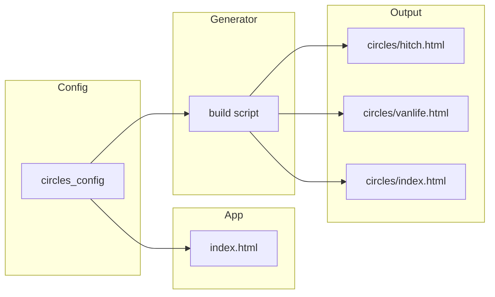

# Circle apps: template and generator

**Idea:** Add a circle "mode" to the existing nr-web map app (single codebase) and a generator that produces one deployable HTML page per Trustroots circle, so each circle gets a dedicated URL (e.g. `/circles/hitch`) that shows only that circle's map notes.

---

## Approach

- **Single codebase**: Reuse `nr-web/index.html` for all circle apps. No copy of the 6000+ line app per circle.
- **Circle mode**: When the app is opened with `?circle=<slug>`, it behaves as a circle-specific app: subscription filtered to that circle, posting always tagged with that circle, circle picker hidden, title/header from config.
- **Generator**: A small build-time script that writes one HTML file per circle under `nr-web/circles/`. Each file is a minimal redirect to `../index.html?circle=<slug>`, giving stable URLs like `nos.trustroots.org/circles/hitch`.
- **Config**: One source of truth for circle slug + display title (and optional note placeholder) used by both the app and the generator.

---

## 1. Circle config (single source of truth)

- Add **nr-web/circles-config.json** with array of `{ slug, title }` (match slugs from `getTrustrootsCircles()` in index.html). In circle mode, index.html fetches it (once) to get the title for the current slug and sets document title and header.
- Generator reads the same JSON to know which pages to generate and what titles to use on the circles index page.

---

## 2. Circle mode in index.html

- **URL**: On load, parse `?circle=<slug>`. If present, set e.g. `window.circleModeSlug = slug` and `selectedCircle = slug`.
- **UI**: When in circle mode: hide the circle selector button; set document title and header to the circle title (from fetched circles-config.json or fallback to slug).
- **Subscription filter**: When subscribing to map notes (kind 30397), if `circleModeSlug` is set, add tag filters: `'#L': ['trustroots-circle']` and `'#l': [circleModeSlug]`. Apply in both the direct relay path (initializeRelays) and the NDK path (subscribeToEvents). May require a separate subscription for MAP_NOTE_KIND with circle filter vs other kinds without.
- **Posting**: No change — when `selectedCircle` is set, tags are already added.
- **Config fetch**: Early in init, if `circleModeSlug` is set, fetch `./circles-config.json`, find the entry for that slug, set document title and header. Fallback: use slug as title if fetch fails.

---

## 3. Generator script

- **Input**: `nr-web/circles-config.json`.
- **Output**:
  - For each circle: `nr-web/circles/<slug>.html` — minimal HTML that redirects to `../index.html?circle=<slug>` (meta refresh or JS). Include a visible link for accessibility.
  - `nr-web/circles/index.html` — landing page listing all circles with links to each circle app.
- **Implementation**: Node script e.g. `nr-web/scripts/generate-circle-pages.js`. Add npm script `"generate-circles": "node scripts/generate-circle-pages.js"`.

---

## 4. Sync circle list and config

- Create circles-config.json with the same slugs as `getTrustrootsCircles()` in index.html, plus humanized titles. Document that new circles must be added to both getTrustrootsCircles() and circles-config.json (or add a sync script later).

---

## 5. Testing and docs

- Optional: unit test for circle mode (selectedCircle, subscription filter); E2E for index.html?circle=hitch; test redirect from circles/hitch.html.
- README: add "Circle apps" section — what they are, how to regenerate (`pnpm run generate-circles`).

---

## 6. Deployment

- Serve nr-web so `/circles/` and `/circles/<slug>.html` are available. Ensure `circles/` and `circles-config.json` are included in the deployed static files.

---

## File change summary

| Action   | File |
|----------|------|
| Add      | `nr-web/circles-config.json` — array of `{ slug, title }` for all circles |
| Add      | `nr-web/scripts/generate-circle-pages.js` — reads config, writes `circles/<slug>.html` and `circles/index.html` |
| Modify   | `nr-web/index.html` — circle mode: URL parse, config fetch, UI hide picker, subscription filter for MAP_NOTE_KIND with #L/#l, title/header from config |
| Modify   | `nr-web/package.json` — add script `generate-circles` |
| Add      | `nr-web/circles/` — directory (generated); commit or .gitignore |
| Modify   | `nr-web/README.md` — "Circle apps" and generator instructions |

---

## Order of implementation

1. Add circles-config.json with slugs and titles (match getTrustrootsCircles).
2. Implement circle mode in index.html (URL, fetch config, title/header, hide picker, subscription filters for both NDK and direct relay).
3. Add generator script and npm script; run it to create circles/*.html.
4. Update README and optionally add tests.

---

## One app idea per Trustroots circle

Concise ideas for each circle: map + notes, discovery, coordination — the same nr-web/nostroots style, just scoped to that community.

### Travel and mobility

| Circle | App idea |
|--------|----------|
| hitch | Hitch spot map — good/bad spots, rest areas, tips (best side, time of day). |
| nomads | Nomad stops — where people are staying for weeks/months; “here until …”, co-work, hosting, meetups. |
| vanlife | Van spots and services — overnight spots, water/dump, showers, safe parking; filter by vehicle size, free/paid. |
| sailors | Marina and anchor notes — marinas, anchorages, customs, repairs; “crew wanted” / “looking for a berth” by place. |
| pilgrims | Pilgrim waypoints — notes along routes (Camino, etc.): water, albergues, detours, trail conditions. |
| motorcyclists | Ride stops — scenic stops, biker-friendly cafés, mechanics, overnight spots; optional route snippets. |
| cyclists | Bike-friendly map — repair shops, bike kitchens, safe parking, showers, warmshowers-style spots. |
| lightfoot | Low-impact travel map — car-free / train / ferry / hitch routes, slow-travel tips, “how I got here without flying”. |

### Outdoors and movement

| Circle | App idea |
|--------|----------|
| climbers | Crag and boulder notes — conditions, grades, access, “who’s here today”. |
| hikers | Trail notes — section notes (water, camping, closures), hitch to trailhead, “hiking this section on …”. |
| surfers | Break and surf notes — break pins, best tide/wind, local rules, board storage or lifts. |
| scubadivers | Dive site notes — sites, conditions, shops, buddies; “diving here this week”. |
| slackline | Slackline spots — parks/spots with anchor options, length, vibe; “slackline session today”. |
| runners | Run meetups and routes — “group run at X”, “trail run tomorrow”; simple route sharing. |
| skateboarders | Skate spots — spots with surface/obstacles, legality, session meetups. |

### Arts, performance, culture

| Circle | App idea |
|--------|----------|
| musicians | Jam and gig map — “jam session here”, open mics, couch for touring musicians, gear share. |
| buskers | Pitch map — good/bad pitches, permits, foot traffic; “busking here today”. |
| artists | Studios and walls — studios, residencies, legal walls; “painting here this week”. |
| photographers | Photo spots and meetups — iconic spots, golden hour, “photo walk on …”. |
| filmmakers | Crew and locations — “looking for DP/editor/actor”, location ideas, screening/workshop. |
| dancers | Dance events and spaces — socials, classes, practicas, where to dance; “beginner-friendly”. |
| lindyhoppers | Lindy map — weekly dances, exchanges, workshops; “in town for the weekend”. |
| jugglers | Juggle meetups — parks/sessions; “juggling at X today”. |
| circus | Circus spots and projects — training spaces, rigging, “looking for partner for doubles”. |
| acroyoga | Acro jams — parks/sessions; “acro jam at X”, level (beginner / mixed). |
| ravers | Party and chill map — after-parties, chill spots, “looking for a ride back”. |
| burners | Burn camp and event map — regional burns, theme camps; “our camp is at …”. |
| rainbowgathering | Gathering waypoints — directions, water, “kitchen at …”, timing. |

### Food and drink

| Circle | App idea |
|--------|----------|
| veg | Veg-friendly map — restaurants, markets; “vegan dinner at my place tonight”. |
| foodsharing | Share points and fridges — fridges, fairteiler, “surplus at …”, pick-up times. |
| cooking | Cook-together map — “community kitchen tonight”, “help me use this produce”. |
| beerbrewers | Brew spots and tastings — homebrew meetups, “tasting at my place”, swap bottles. |
| winemakers | Wine spots — vineyards, tastings, “help with harvest”, casual meetups. |
| zero-wasters | Zero-waste map — bulk shops, refill, repair cafés; “free stuff at …”. |

### Living and values

| Circle | App idea |
|--------|----------|
| ecoliving | Eco spots and projects — communes, eco-villages, workaways; “visitors welcome”. |
| dumpsterdivers | Dive map (private or semi-private) — spots, days/times; “diving tonight”. |
| squatters | Squat and social centre map — info, events; “need a floor tonight”. |
| families | Family-friendly spots — parks, kid-friendly cafés; “traveling with kids, meetup?”. |
| volunteers | Volunteer map — projects; “help needed at …”, workaway-style. |
| activists | Action and safe spaces — actions, legal support, “bail fund”, safe houses. |
| anarchists | Infoshop and event map — infoshops, bookfairs, assemblies, skill-shares. |
| feminists | Feminist spaces and events — collectives, events; “women/FLINTA only” where relevant. |
| lgbtq | Queer-friendly map — bars, spaces; “queer dinner tonight”, safety notes. |
| naturists | Naturist spots — beaches, camps, saunas; respect and consent notes. |

### Mind and body

| Circle | App idea |
|--------|----------|
| yoga | Yoga map — classes, outdoor sessions; “yoga in the park at …”, exchange. |
| spirituals | Circles and retreats — meditations, circles, retreats; “silent sit at …”. |

### Tech and knowledge

| Circle | App idea |
|--------|----------|
| hackers | Hackerspace and event map — spaces, lock-picking nights, “pair programming”. |
| cypherpunks | Crypto/privacy map — key-signing, PGP; “running a signing party at …”. |
| books | Book swap and reading — “free library here”, “reading group at …”, bookcrossing-style. |

### Other

| Circle | App idea |
|--------|----------|
| gardeners | Garden map — allotments, guerrilla gardens; “help in the garden”, seed swap. |
| punks | Punk map — venues, squats, diy spaces; “show tonight”, “floor for the weekend”. |
